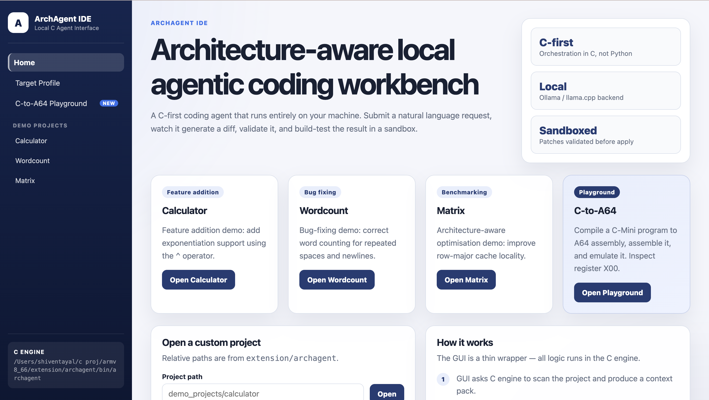
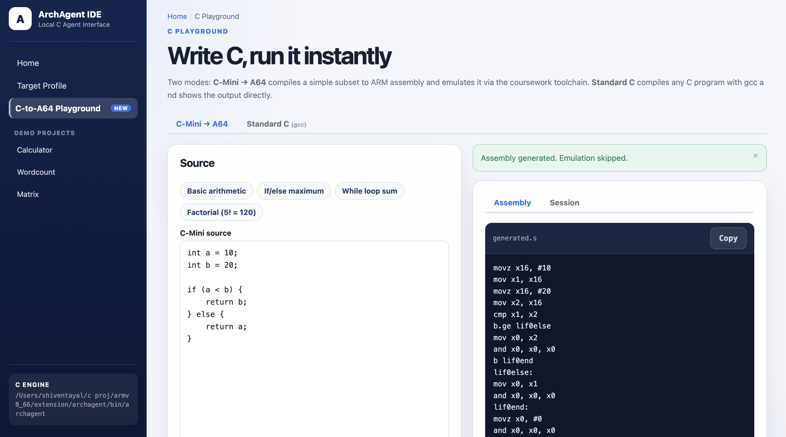

# ArchAgent

[](LICENSE)
[](https://en.cppreference.com/w/c/17)
[](#build)
[](https://github.com/shiventayal6-bit/archagent/actions/workflows/ci.yml)

**AI-assisted code modification engine — C17, zero runtime dependencies.**

ArchAgent takes a natural-language change request, generates a validated patch via a local LLM, applies it in an isolated sandbox, builds and tests it, and returns a structured JSON result. Everything runs offline.

> **About this repository.**
> This repository contains the Extension developed for Imperial College London's Computing Practical project.
> The core coursework (Parts I–III) — an ARMv8-A64 assembler and emulator — forms part of assessed university material and is therefore proprietary and cannot be published.
> This repository contains the complete Extension developed by our team, together with all code required to build, run and evaluate the extension independently.

---

<p align="center">
  
  <br><em>Home page: demo project cards and the open-project form</em>
</p>

<p align="center">
  
  <br><em>C-to-A64 Playground: C-Mini source compiled and shown alongside generated A64 assembly</em>
</p>

---

## Table of Contents

- [Quick Start](#quick-start)
- [Overview](#overview)
- [Architecture](#architecture)
- [Features](#features)
- [Repository Layout](#repository-layout)
- [Build](#build)
- [Usage](#usage)
- [LLM Backends](#llm-backends)
- [JSON Output Reference](#json-output-reference)
- [C-Mini Language](#c-mini-language)
- [Design Decisions](#design-decisions)
- [Module Documentation](#module-documentation)
- [Future Work](#future-work)
- [License](#license)

## Quick Start

No external model needed — the mock backend is built in.

```sh
git clone https://github.com/shiventayal6-bit/archagent.git
cd archagent
make
make demo-calculator
```

Expected output:

```json
{
  "ok": true,
  "session_id": "20260614_153021_12345",
  "project": "demo_projects/calculator",
  "backend": "mock",
  "patch_validated": true,
  "sandbox_created": true,
  "build": { "ran": true, "exit_code": 0, "passed": true },
  "tests": { "ran": true, "exit_code": 0, "passed": true },
  "benchmark": { "ran": false },
  "summary": "Patch validated, applied in sandbox, build passed and tests passed."
}
```

C-Mini compiler playground:

```sh
./bin/archagent \
  --c2asm-code "int n = 5; int r = 1; while (n > 1) { r = r * n; n = n - 1; } return r;" \
  --json
```

```json
{
  "ok": true,
  "stage": "emulate",
  "return_value": 120,
  "return_value_hex": "0x0000000000000078"
}
```

## Overview

ArchAgent orchestrates a 17-step pipeline from request to verified patch:

```
 1.  Scan project          →  structured file index
 2.  Pack context          →  relevant files within byte budget
 3.  Build prompt          →  system profile + context + request
 4.  Call LLM backend      →  raw model response
 5.  Parse response        →  plan / patch / tests
 6.  Parse diff            →  structured hunks
 7.  Validate patch        →  safety checks (no traversal, no escapes)
 8.  Create sandbox        →  isolated timestamped session directory
 9.  Copy project          →  project → sandbox
 10. Apply patch           →  fuzzy hunk matching
 11. Build in sandbox      →  allowlist-guarded make
 12. Test in sandbox       →  allowlist-guarded test runner
 13. Benchmark (optional)  →  optional bench command
 14. Write result.json     →  machine-readable outcome
 15. Write events.jsonl    →  JSONL audit log
 16. Print result          →  JSON or human-readable
 17. Apply to original     →  only if --apply is passed
```

A second, self-contained sub-system — the **C-to-A64 Playground** — compiles a minimal subset of C (C-Mini) to ARMv8 assembly through a hand-written lexer, recursive-descent parser, and code generator, then assembles and executes the result.

## Architecture

### Main Pipeline

```
 Natural Language Request
          │
          ▼
 ┌────────────────────┐
 │   project_scanner  │  Recursive file discovery; classifies
 │                    │  sources, headers, Makefiles, tests
 └─────────┬──────────┘
           │  ProjectIndex
           ▼
 ┌────────────────────┐
 │  context_packer    │  Budget-aware relevance selection
 │                    │  (default 30 KB window)
 └─────────┬──────────┘
           │  ContextPack
           ▼
 ┌────────────────────┐
 │  prompt_builder    │  Assembles: TargetProfile
 │                    │           + ContextPack
 │                    │           + user request
 └─────────┬──────────┘
           │  Prompt (text)
           ▼
 ┌──────────────────────────────────────┐
 │              LLM Backend             │
 │  ┌──────────┐  ┌────────┐  ┌──────┐ │
 │  │   mock   │  │ llama  │  │ollama│ │
 │  │(built-in)│  │ (.gguf)│  │(HTTP)│ │
 │  └──────────┘  └────────┘  └──────┘ │
 └───────────────────┬──────────────────┘
                     │  ModelResponse
                     ▼
 ┌────────────────────┐
 │  response_parser   │  Extracts <PLAN>, <PATCH>, <TESTS>
 └─────────┬──────────┘
           │  ParsedResponse
           ▼
 ┌────────────────────┐
 │   diff_parser      │  Unified diff → FilePatch → DiffHunk
 └─────────┬──────────┘
           │  ParsedDiff
           ▼
 ┌────────────────────┐
 │  patch_validator   │  Rejects ../ traversal, absolute paths,
 │                    │  writes outside project root
 └─────────┬──────────┘
           │  ValidationReport (ok=true)
           ▼
 ┌────────────────────┐
 │     sandbox        │  .archagent/sessions/YYYYMMDD_HHMMSS_<pid>/
 └─────────┬──────────┘
           │  Sandbox (paths)
           ▼
 ┌────────────────────┐
 │  patch_applier     │  Fuzzy hunk application
 │                    │  (±5 line window, whitespace-normalised)
 └─────────┬──────────┘
           ▼
 ┌────────────────────┐
 │  command_runner    │  Allowlist-guarded subprocess
 │                    │  with timeout + stdout/stderr capture
 └─────────┬──────────┘
           │  CommandResult (build + test)
           ▼
 ┌────────────────────┐
 │  audit_logger      │  result.json + events.jsonl
 │                    │  + per-stage artefact files
 └────────────────────┘
```

### C-to-A64 Playground

```
 C-Mini source text
        │
        ▼  lexer_init / lexer_next     → Token stream
        │
        ▼  parser_parse                → AST (AstNode tree)
        │
        ▼  codegen_generate            → A64 assembly text → session/generated.s
        │
        ▼  execv(assemble)             → Binary            → session/program.bin
        │
        ▼  execv(emulate)              → Output            → session/emulator.out
        │
        ▼  parse X00 register
        │
   uint64_t return value + result.json
```

## Features

| Feature | Detail |
|---------|--------|
| **Three LLM backends** | `mock` (built-in, no deps), `llama` (local llama.cpp), `ollama` (HTTP API) |
| **Sandboxed execution** | All changes happen in an isolated session copy; original is never modified unless `--apply` is passed |
| **Patch safety** | Directory-traversal rejection, write-outside-root checks, path canonicalisation |
| **Fuzzy patch application** | ±5-line tolerance window with whitespace-normalised context-line matching |
| **Structured JSON output** | Every stage emits a machine-readable result suitable for CI integration |
| **Full audit trail** | Per-session artefacts: prompt, raw model response, diff, build/test logs, `result.json`, `events.jsonl` |
| **C-Mini compiler** | Complete pipeline: hand-written lexer → recursive-descent parser → A64 code generator |
| **Flask web UI** | Browser-based interface to the full pipeline and C-to-A64 playground |
| **14 unit tests** | One test file per module, plus an end-to-end integration test with the mock backend |
| **Three demo projects** | Calculator, word-count, matrix — each with a canned mock scenario |
| **Zero runtime dependencies** | Single statically-linked C binary; no interpreter, no framework |

## Repository Layout

```
archagent/
├── src/                      # 20 C implementation files (~5 400 LOC)
│   ├── main.c                # CLI entry point; 17-step pipeline orchestration
│   ├── config.c              # Argument parsing
│   ├── target_profile.c      # Host system fingerprinting (OS, compiler, arch)
│   ├── project_scanner.c     # Recursive file discovery and classification
│   ├── context_packer.c      # Budget-aware context selection (default 30 KB)
│   ├── prompt_builder.c      # Prompt assembly from profile + context + request
│   ├── response_parser.c     # Extracts plan / patch / tests from model output
│   ├── diff_parser.c         # Unified diff → ParsedDiff → FilePatch → DiffHunk
│   ├── patch_validator.c     # Safety checks before any files are written
│   ├── patch_applier.c       # Fuzzy hunk application inside the sandbox
│   ├── sandbox.c             # Session directory creation and project copy
│   ├── command_runner.c      # Allowlist-guarded subprocess with timeout + capture
│   ├── audit_logger.c        # JSONL event log + per-session artefact files
│   ├── mock_backend.c        # Built-in canned responses (no external deps)
│   ├── llama_backend.c       # llama-cli subprocess wrapper
│   ├── ollama_backend.c      # Ollama HTTP API client (streaming JSONL)
│   ├── c2asm_pipeline.c      # C-to-A64 pipeline orchestration
│   ├── c2asm_lexer.c         # C-Mini tokeniser (tracks line/col for errors)
│   ├── c2asm_parser.c        # Recursive-descent parser → AST
│   └── c2asm_codegen.c       # AST → ARMv8 A64 assembly (X1–X15 variable alloc)
├── include/                  # Public headers — one per module
├── tests/                    # 14 unit test programs + test_helpers.h
├── examples/                 # C-Mini source programs (.cmini)
│   ├── c2asm_basic.cmini
│   ├── c2asm_loop.cmini
│   ├── c2asm_branch.cmini
│   └── c2asm_factorial.cmini
├── demo_projects/
│   ├── calculator/           # Add exponentiation operator
│   ├── wordcount/            # Fix multi-space/newline word counting
│   └── matrix/               # Optimise traversal for cache locality
├── gui/                      # Flask web UI (app.py + 7 Jinja2 templates)
├── assets/                   # Screenshots
├── docs/
│   └── architecture.md       # Full module reference: APIs, structs, data flow
├── Makefile
├── LICENSE
└── CONTRIBUTING.md
```

## Build

**Requirements:** C17 compiler (`gcc` ≥ 9 or `clang` ≥ 11), GNU Make, POSIX OS (Linux or macOS). Python 3 + Flask for the web UI only.

```sh
git clone https://github.com/shiventayal6-bit/archagent.git
cd archagent
make                   # → bin/archagent
make test              # 14 unit tests
make test-c2asm        # C-to-A64 compiler tests only
make clean
```

## Usage

### AI Patch Workflow

```sh
# Built-in mock backend — no model required
./bin/archagent \
  --project demo_projects/calculator \
  --request "Add exponentiation support using ^" \
  --backend mock --yes --json

# Local model via llama.cpp (fully offline)
./bin/archagent \
  --project my_project/ \
  --request "Replace the linear search with binary search" \
  --backend llama \
  --model ~/models/qwen2.5-coder-7b-instruct-q4_k_m.gguf \
  --build-cmd "make" --test-cmd "make test" --yes

# Ollama (requires Ollama running on localhost:11434)
./bin/archagent \
  --project my_project/ \
  --request "Add input validation to all public functions" \
  --backend ollama --model qwen2.5-coder:7b \
  --build-cmd "make" --test-cmd "make test"
```

Inspect without modifying:

```sh
./bin/archagent --profile                       # host system profile
./bin/archagent --scan --project my_project/    # file index
```

### C-to-A64 Playground

```sh
# Inline source: compute 5! = 120
./bin/archagent \
  --c2asm-code "int n = 5; int r = 1; while (n > 1) { r = r * n; n = n - 1; } return r;" \
  --json

# Compile a .cmini file; print generated assembly only
./bin/archagent --c2asm examples/c2asm_factorial.cmini --emit-asm-only
```

Generated A64 assembly for `c2asm_factorial.cmini`:

```asm
.text
.global _start
_start:
    MOV X1, #5
    MOV X2, #1
__while_0_cond:
    CMP X1, #1
    BLE __while_0_end
    MUL X16, X2, X1
    MOV X2, X16
    SUB X1, X1, #1
    B __while_0_cond
__while_0_end:
    MOV X0, X2
    MOV X8, #93
    SVC #0
```

### Web UI

```sh
make gui
# Open http://127.0.0.1:5050
```

### Demo Targets

```sh
make demo-calculator   # mock: add exponentiation to a calculator
make demo-wordcount    # mock: fix multi-space word counting
make demo-matrix       # mock: optimise matrix traversal + benchmark
make demo-c2asm        # C-Mini → A64 → emulator: factorial
```

## LLM Backends

| Backend | Flag | Requirements | Notes |
|---------|------|--------------|-------|
| `mock` | `--backend mock` | None | Built-in canned responses; ideal for CI |
| `llama` | `--backend llama --model /path/to/model.gguf` | [`llama-cli`](https://github.com/ggml-org/llama.cpp) on `$PATH` | Fully offline |
| `ollama` | `--backend ollama --model qwen2.5-coder:7b` | [Ollama](https://ollama.com) on `localhost:11434` | Convenient local HTTP API |

Model weight files (`.gguf`) are not included. Obtain them separately from a source you are licensed to use.

**llama.cpp setup:**

```sh
brew install llama.cpp          # macOS

# Linux — build from source
git clone https://github.com/ggml-org/llama.cpp
cmake -S llama.cpp -B llama.cpp/build && cmake --build llama.cpp/build -j $(nproc)
export PATH="$PATH:$(pwd)/llama.cpp/build/bin"

# Download a model (keep outside the repo)
# https://huggingface.co/Qwen/Qwen2.5-Coder-7B-Instruct-GGUF
huggingface-cli download Qwen/Qwen2.5-Coder-7B-Instruct-GGUF \
  qwen2.5-coder-7b-instruct-q4_k_m.gguf --local-dir ~/models/
```

If `llama-cli` is not on `$PATH`, or `--model` is absent or invalid, ArchAgent exits cleanly with `"ok": false` and a descriptive message — it never crashes or hangs.

## JSON Output Reference

All modes support `--json`. Pipe into `jq` or a CI result parser.

**Patch workflow (`--request`):**

```json
{
  "ok": true,
  "session_id": "20260614_153021_12345",
  "project": "demo_projects/calculator",
  "backend": "mock",
  "patch_validated": true,
  "sandbox_created": true,
  "build":     { "ran": true, "exit_code": 0, "passed": true },
  "tests":     { "ran": true, "exit_code": 0, "passed": true },
  "benchmark": { "ran": false },
  "session_dir": ".archagent/sessions/20260614_153021_12345/context",
  "summary": "Patch validated, applied in sandbox, build passed and tests passed."
}
```

**C-to-A64 playground (`--c2asm`):**

```json
{
  "ok": true,
  "stage": "emulate",
  "session_id": "20260614_153022_12346",
  "session_dir": ".archagent/sessions/20260614_153022_12346/c2asm",
  "assembly_path": ".archagent/sessions/.../c2asm/generated.s",
  "binary_path":   ".archagent/sessions/.../c2asm/program.bin",
  "return_value_available": true,
  "return_value":     120,
  "return_value_hex": "0x0000000000000078"
}
```

**Session artefacts** (`.archagent/sessions/<id>/context/`):

```
profile.txt            host profile sent to the model
project_index.txt      file list with sizes
prompt.txt             full assembled prompt
model_response.txt     raw model output
parsed_plan.txt        extracted plan section
patch.diff             extracted unified diff
validation_report.txt  patch safety check result
build_stdout.txt  /  build_stderr.txt
test_stdout.txt   /  test_stderr.txt
benchmark.txt          (if --bench-cmd was supplied)
result.json            structured outcome
events.jsonl           JSONL audit log
```

## C-Mini Language

| Construct | Example |
|-----------|---------|
| Variable declaration | `int x = 42;` |
| Assignment | `x = x + 1;` |
| Arithmetic | `x + y`, `x - y`, `x * y`, `x / y` |
| Comparison | `x == y`, `x != y`, `x < y`, `x <= y`, `x > y`, `x >= y` |
| Conditional | `if (cond) { ... } else { ... }` |
| Loop | `while (cond) { ... }` |
| Return | `return expr;` |

Up to 15 user variables, mapped to registers X1–X15. Temporaries use X16–X25. Return value in X0. Program exits via `sys_exit` (syscall 93).

## Design Decisions

**Why C17?**
A single statically-linked binary with no runtime dependency chain. Demonstrates memory management discipline, explicit ownership, and zero-overhead abstractions — directly relevant to the systems audience this tool targets.

**Why sandboxing?**
The pipeline applies model-generated patches. A sandbox means a single bad patch cannot corrupt the original project. All build and test commands run inside the session copy; `--apply` is required to write back to the original.

**Why a hand-written parser?**
The C-Mini compiler uses recursive descent rather than a parser generator. This keeps the dependency count at zero and makes error messages point to exact source locations without intermediate grammars.

**Why fuzzy patch application?**
LLMs sometimes emit diffs with off-by-one line numbers or whitespace differences in context lines. The fuzzy applier uses a ±5-line search window and whitespace-normalised context matching to absorb these imprecisions rather than failing on every minor discrepancy.

**Why three backends?**
Mock enables fully offline demos and CI with zero setup. llama supports air-gapped operation. Ollama offers a convenient local HTTP API without manual llama.cpp compilation. All three implement the same `bool <name>_backend_generate(...)` interface — swapping is a single flag change.

## Module Documentation

Full API reference, data structure descriptions, and data flow diagrams: [docs/architecture.md](docs/architecture.md)

## Future Work

- **Incremental context selection** — weight files by semantic similarity to the request rather than a simple byte budget
- **Multi-file patch transactions** — validate all hunks across all files before applying any, with atomic rollback on partial failure
- **Streaming LLM output** — pipe model tokens to the parser incrementally to reduce time-to-first-hunk latency
- **LLVM IR backend for C-Mini** — emit LLVM IR in addition to A64 assembly, enabling portable optimisation passes
- **Tree-sitter context selection** — use a proper parse tree to select semantically relevant functions rather than whole files
- **GitHub Actions reusable workflow** — publish an action that runs ArchAgent patch checks on pull requests

## License

MIT. See [LICENSE](LICENSE).
